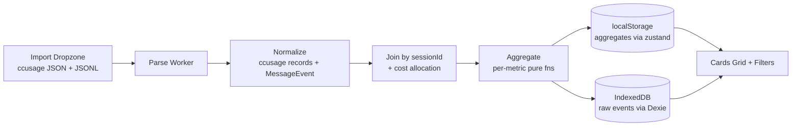

# AI Usage Dashboard — 設計文件

- 日期：2026-07-11
- 狀態：設計定案，待實作
- 一句話：純前端、零安裝、拖拉上傳 ccusage JSON + 原始 JSONL，產品級 AI 使用分析 dashboard。

## 1. 目標與定位

把 Claude Code / Codex 等 agent CLI 的用量資料，做成 **Linear Analytics × Vercel Analytics × GitHub Insights** 風格的分析面板，超越社群現有的「Usage Viewer」層次。

**差異化定位**：現有 OSS（ccgauge、MyCCusage、phuryn/claude-usage、Maciek monitor 等）全部跑本地 server/daemon watch `~/.claude`。本專案走**純靜態站、拖拉上傳、可分享連結、零安裝、不落地 DB**。無人做這條路。

**非目標（YAGNI）**：後端、auth、多使用者、即時 watch、ML 預測、GitHub commit ROI。

## 2. 資料來源（已查證，2026-07-11）

兩個來源互補，**以 `sessionId` join**（ccusage `session.period` 是 UUID，等於 JSONL `sessionId`）。

### 2.1 ccusage JSON（權威成本來源）

`npx ccusage <cmd> --json` 產出。可收欄位：

- `daily` / `weekly` / `monthly`：每列 `period`(日期字串)、`agent`、`inputTokens` / `outputTokens` / `cacheCreationTokens` / `cacheReadTokens` / `totalTokens`、`totalCost`、`modelBreakdowns[]`(每 model 的 `cost` + 各 token 類型)、`modelsUsed[]`。
- `session`：同上 + `metadata.lastActivity`(timestamp)，`period` = session UUID。
- `blocks`(5h 計費視窗)：`startTime` / `endTime` / `actualEndTime`、`costUSD`、`burnRate{costPerHour, tokensPerMinute}`、`projection{remainingMinutes, totalCost, totalTokens}`、`isActive`、`isGap`、`models[]`、`tokenCounts{...}`。

**限制**：無 cwd / 專案、無逐訊息時間戳。session 只有 UUID。

### 2.2 原始 JSONL（`~/.claude/projects/**/*.jsonl`，維度來源）

每列一則訊息事件，可收欄位：

- `sessionId`（join key）、`cwd`（→ 專案）、`gitBranch`、`timestamp`（逐訊息，→ 時段 heatmap）、`version`（Claude Code 版本）
- `message.model`、`message.usage.{input_tokens, output_tokens, cache_creation_input_tokens, cache_read_input_tokens, ...}`
- agent 類型可由來源檔路徑/欄位推得

**限制**：**無成本欄位**（成本需 pricing table 或由 ccusage 提供）。

### 2.3 匯入方式：一鍵打包指令（唯一路徑）

手動多選數百個巢狀 `~/.claude/projects/**/*.jsonl` 體驗差。改為**單一匯入路徑**：copy-paste 一行指令，在本機組出**單一 bundle 檔**（同時含 ccusage 成本 + 原始 jsonl），拖一次上傳。

**機制**：node 一行 script（npx 能跑就有 node，免額外安裝）→ 跑 ccusage 三個 `--json` + 遞迴讀所有 jsonl → 組成 JSON envelope → gzip 輸出。client 端用 **fflate**（~8KB）gunzip 後 `JSON.parse`，免 tar 解析、跨平台穩、client 最輕。

**Bundle envelope 格式**：

```json
{
  "v": 1,
  "generatedAt": "<ISO ts>",
  "ccusage": { "daily": {...}, "session": {...}, "blocks": {...} },
  "sessions": [
    { "sessionId": "...", "project": "<cwd>", "gitBranch": "...",
      "events": [ { "ts": "...", "model": "...", "usage": {...} } ] }
  ]
}
```

- 指令**預先解析** jsonl 逐行 → envelope 內已是結構化事件，client 不必再逐行 parse JSONL（parser 模組仍保留做 envelope 驗證與防呆）。
- 成本與維度同一步產出 → **不再有「傳兩次」摩擦**；正常情況 bundle 一定同時含 ccusage + jsonl。
- 使用者需在網站上看到**可複製的指令區塊**（一鍵 copy）與簡短說明。

**已砍**：webkitdirectory 資料夾選取器（成本讀不到、隱私觀感差、UX 分裂）。列 future 備案。

### 2.4 Join 與成本分攤

- 以 `sessionId` join：ccusage 給該 session 權威成本，JSONL 給該 session 的 cwd / branch / 逐訊息時間戳 / model。
- **成本分攤**：session 成本依「同 model 內各訊息 token 權重」分攤到每則訊息 → 可攤到專案 / 小時。
- **不變式**：Σ 分攤成本 == session `totalCost`（作為測試斷言）。
- **不維護 pricing table**（刻意設計，避免追 model 價格變動）；成本一律源自 ccusage。

## 3. 技術選型

- 建置：**Vite + React + TypeScript**（純 client SPA，無 SSR 負擔）。pnpm。
- 圖表：**ECharts**（heatmap / stacked area / timeline batteries-included），必要時 visx 當逃生口。
- 狀態：**zustand** + `persist` middleware → 聚合結果落 localStorage。
- 原始事件：**IndexedDB**（Dexie）。
- 解析：**Web Worker**，大 JSONL 不卡 UI。
- 樣式：Tailwind + 輕量 component 層（shadcn 風格）。

## 4. 架構（5 層）

```
匯入 → 解析/正規化 → Join+成本分攤 → 聚合 → 儲存 → 檢視
```



- **匯入**：兩 dropzone，依 shape 自動辨識檔案類型。
- **解析**（Worker）：ccusage → 正規化成本記錄；JSONL → `MessageEvent[]`。
- **Join+分攤**：見 2.3。
- **聚合**：每指標一支純函式。
- **儲存**：聚合 → localStorage（小、可存活 reload）；原始事件 → IndexedDB（大、供 drill-down 與重切）。
- **檢視**：卡片 grid + 全域 filter（日期範圍 / 專案 / model / agent / branch）。

## 5. 模組（隔離、可獨立測試）

| 單元 | 職責 | 相依 |
|---|---|---|
| `parsers/bundle.ts` | 純：gunzip(fflate) + 驗證 envelope → { ccusage, sessions } | fflate |
| `parsers/ccusage.ts` | 純：ccusage JSON → 正規化 | 無 |
| `parsers/jsonl.ts` | 純：jsonl 事件 → MessageEvent[]（envelope 驗證/防呆） | 無 |
| `join/allocateCost.ts` | 純：(session 成本, events) → 帶成本 events | 無 |
| `aggregate/*.ts` | 每指標一支純函式 | normalized types |
| `workers/parse.worker.ts` | offload 解析+join+聚合 | 上述純模組 |
| `store/useDataStore.ts` | zustand+persist（聚合+meta+filter） | — |
| `store/rawDb.ts` | Dexie wrapper（原始事件） | Dexie |
| `components/ImportDropzone.tsx` | 單一 bundle 拖拉 + 可複製指令區塊 UI | store |
| `components/Filters.tsx` | 全域 filter | store |
| `components/DashboardGrid.tsx` | 卡片佈局 | cards |
| `components/cards/*.tsx` | 每張卡一個 component | selectors |

**隔離原則**：parser / allocate / aggregate 全為純函式（無 IO），可用 fixture 單測；worker 只做編排；store 只管持久化與 selector；card 只讀 selector。

## 6. 卡片清單（MVP）

原始 12 張 + 8 項借鏡增強（來源：ccgauge / Maciek monitor / claudefana）。

| # | 卡片 | 來源資料 | 計算 |
|---|---|---|---|
| 1 | KPI：總額 / 日均 / Burn rate | ccusage blocks+daily | sum、mean、`burnRate.costPerHour`；**每項帶 day-over-day delta** |
| 2 | **Live 5h block** | ccusage blocks | `isActive` 區塊倒數 + 進度條 + `projection.totalCost` |
| 3 | 每日成本 area | daily | totalCost by date |
| 4 | Token 組成 stacked area | daily | in / out / cacheCreate / cacheRead |
| 5 | Model usage timeline | daily.modelBreakdowns | cost by model×date |
| 6 | $/1M output 效率 | modelBreakdowns | cost ÷ outputTokens ×1e6 |
| 7 | Cache 命中率趨勢 + **節省量** | daily | cacheRead ÷ total；節省以 **token 數 + 比例**呈現（不做 $，因不維護 pricing table） |
| 8 | 專案排行 | JSONL cwd + 分攤成本 | cost / tokens by 專案；**worktree 收合**（去 cwd worktree 後綴 → 同 repo 一列） |
| 9 | 時段 heatmap | JSONL ts + 分攤成本 | cost by 星期×小時 |
| 10 | Claude vs Codex 比例 | agent 欄 | cost share by agent；Codex 標示為 **OpenAI API equivalent** |
| 11 | Session 上下文分布 | JSONL / session 總量 | per-session token 直方圖 + **P90 / 百分位帶** |
| 12 | 成本預測 | daily + blocks.projection | 線性月底推估 + 當前 block 推估 |
| 13 | 「今天為什麼花這麼多」 | daily delta | 今日 vs 近 7 日均，按 model / project / cache 拆解 Δ |

**互動**：Session drill-down — 從卡片點入單一 session → 讀 IndexedDB 原始事件 → 訊息級 timeline。

**獨家維度**：`gitBranch` 當 filter（沒有其他 ccusage 工具做，因 ccusage JSON 無此欄）。

## 7. 錯誤 / 部分資料處理

- bundle 非預期格式 / 版本不符 / gunzip 失敗 → 明確錯誤 + 指令重跑提示，不中斷。
- 正常 bundle 一定同時含 ccusage + jsonl；下列部分資料狀態僅在使用者手改 bundle 或舊版指令時出現：
  - **缺 ccusage 區塊**：token / 專案 / heatmap 正常；成本卡顯示「bundle 缺成本，請以最新指令重產」（無 pricing table 為刻意設計）。
  - **缺 sessions 區塊**：成本卡正常；專案 / heatmap / drill-down 顯示空狀態。
- **sessionId 對不上**：部分 join；顯示 **coverage %** badge；未匹配成本僅保留全域層級，不強行攤到專案 / 小時。
- **jsonl 壞行**（指令端已預解析，殘餘壞事件）：略過、計數、UI 回報略過筆數。
- localStorage quota：僅存聚合（小）；原始事件走 IndexedDB，避開 ~5MB 上限。

## 8. 測試策略

- 純 parser / aggregator → fixture 單元測試（擷取小份**去識別化**真實樣本）。
- 分攤不變式：Σ 分攤成本 == session `totalCost`。
- Join：未匹配 session、coverage % 計算正確。
- 邊界：空匯入、單一 model、單一 agent、大檔（worker 不阻塞）、壞行略過。

## 9. 範圍收斂與 future

**MVP 砍掉**：

- GitHub commit ROI / cost-per-commit / 每 $ 產出行數（需 git 外部資料）。
- Tool-usage mix（Bash/Read/Edit 呼叫分布）— 資料可得（JSONL tool_use），但延後。
- Edit accept/reject 率（需解析 tool_result，heuristic 脆）。
- 後端、auth、即時 watch、ML 預測。

**Future（列而不做）**：接 git log 做 ROI；tool-usage mix 卡；exploration vs implementation 階段分析；webkitdirectory 資料夾選取器（零終端機備援匯入，成本另處理）。

## 10. 已查證事實出處

- ccusage 實際 JSON schema：本機 `npx ccusage@latest {daily,session,blocks} --json` 實測。
- 原始 JSONL schema：本機 `~/.claude/projects/**/*.jsonl` 實測，確認 `cwd` / `gitBranch` / `timestamp` / `message.usage.*` / `sessionId`。
- OSS 借鏡：ccgauge、Maciek-roboblog/Claude-Code-Usage-Monitor、i-richardwang/MyCCusage、juanjofuchs claudefana、ocodista/claude-usage、phuryn/claude-usage。

## 11. As-built 註記（Plan 1 完成，2026-07-11）

- **多 agent 成本來源**：ccusage `daily` 每列 agent 恆為 `'all'`；真實 per-agent 成本在 `session` 列（實測 codex 635 / claude 226 / gemini 21 / opencode 1）。故 agentShare 以 `n.session` 依 `session.agent` 聚合。
- **覆蓋範圍限制**：bundle 產生器只走 `~/.claude/projects`（Claude Code JSONL）。codex / gemini / opencode 有 ccusage 成本但無 JSONL → 出現在 KPI、agentShare，但不進專案排行 / 時段 heatmap。Coverage % 以 `matchedCost/totalCost` 呈現，UI 需說明此差異（agent 卡總額會大於專案排行總額）。
- **成本分攤不變式**：以 sessionId join，session 成本依 token 權重分攤到訊息；listed model 分自身 breakdown 成本，未列 model / phantom breakdown / drift 由 pooled residual 承接，Σ 分攤 == session totalCost 無條件成立。
- **時段 heatmap 時區**：目前 UTC，Plan 2 決定是否改本地時間（需傳入 tz offset 維持純函式）。
