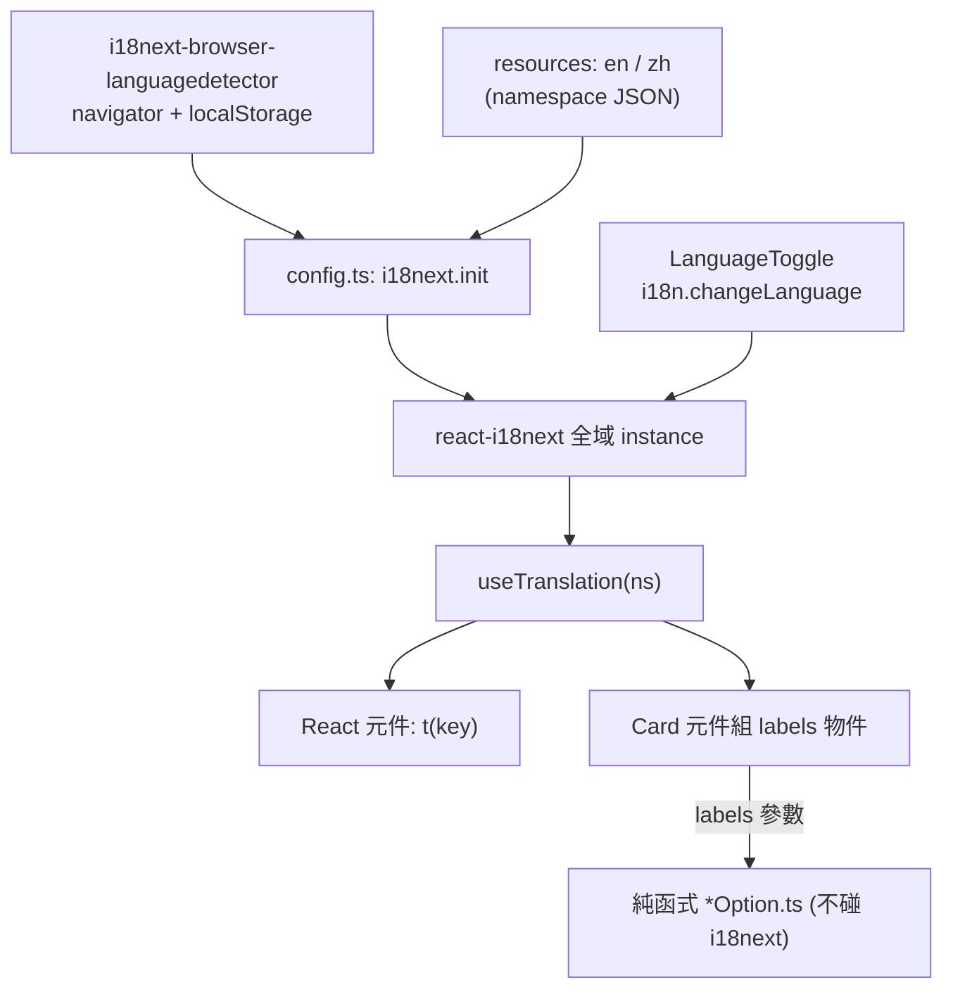

# i18n Setup 設計（對齊 argus frontend）

- 日期：2026-07-12
- 狀態：As-built（已實作，branch `feat/i18n-setup`，commits a5db69a..8168f36）
- 範圍：前端 cc-dashboard 導入 i18n，並全量遷移「元件層」可見字串。

## As-built 補述（與原設計的差異）

- **EXPORT_HINT 例外**：`src/export/exportCommand.ts` 原列 out-of-scope，但其 `EXPORT_HINT` 常數會在 `ImportPanel` 首屏渲染（是浮上 UI 的可見字串，不符合排除理由）。已將其搬入 `import` namespace（`import.step1.hint`）並從 `exportCommand.ts` 移除該 export。§11 的 out-of-scope 僅適用於「未浮上 UI 的字串」。
- **共用 `fillTemplate`**：tooltip 的 `{{var}}` 代入邏輯抽到純函式 `src/features/charts/fillTemplate.ts`，由 hourHeatmap / modelEfficiency / sessionDist 三個 builder 共用（原設計未預期抽共用模組）。
- **Input / Output 保留英文**：`costByTokenType` / `tokenComposition` 的 series 名 `Input`/`Output` 原本即為英文（非中文），依決策維持英文不 localize（技術術語跨語系一致，與未譯的 `Cache` 對齊）。
- **FilterBar preset** label key 用 literal-union 型別（非 `string`）以滿足 i18next key 型別安全。
- 最終驗收：`pnpm build` / `pnpm test`（129）/ `pnpm i18n:check` 全綠、全清。

## 1. 目標與非目標

### 目標

- 導入與 argus frontend 相同的 i18n 技術棧與目錄慣例（`react-i18next` + `i18next` + `i18next-browser-languagedetector`）。
- 支援 `en` 與 `zh-TW` 兩種語言；`fallbackLng: 'en'`，初始語言由 browser detector 決定並持久化到 localStorage。
- 提供 `LanguageToggle`（繁中 ⇄ English），外觀對齊既有 `ThemeToggle`，並排放在 header 右側。
- 全量遷移「元件層」的 hardcoded 字串到 i18n（`t()`），並提供完整 `en` 與 `zh-TW` 兩份翻譯。
- `t()` 具型別安全（key 錯字在 `pnpm build` 時報錯）。

### 非目標（YAGNI / 明確排除）

- 不遷移非 UI 檔的字串：`src/parsers/`、`src/workers/`、`src/store/`、`src/export/`、`src/import/*.ts`（純邏輯層）。這些檔案裡的中文多為註解或尚未浮上 UI 的錯誤訊息，維持現狀，之後另議。
- 不做語言以外的 locale 格式化改造（數字、貨幣、日期格式維持現有 `src/ui/format.ts` 邏輯）。
- 不引入翻譯平台 / CI 自動翻譯；翻譯內容人工維護。
- 不改動聚合 / parser / option 的成本計算與純函式不變式（見 §5 對純函式的處理）。

## 2. 技術棧與依賴

| 套件 | 用途 | 類型 |
| --- | --- | --- |
| `i18next` | 核心 i18n 引擎 | dependency |
| `react-i18next` | React 綁定（`useTranslation` hook） | dependency |
| `i18next-browser-languagedetector` | 偵測 + 持久化語言（navigator / localStorage） | dependency |
| `@lingual/i18n-check` | 檢查各 locale key 缺漏 / 多餘 | devDependency |

版本對齊 argus（i18next ^26、react-i18next ^17、language-detector ^8、i18n-check ^0.9），實作時以 pnpm 解析當下相容版本為準。

新增 script（對齊 argus）：

```json
"i18n:check": "i18n-check --locales src/i18n -s en -f i18next"
```

## 3. 目錄結構

```
src/i18n/
  config.ts            # 建立 i18next instance、註冊 detector、init 設定
  i18next.d.ts         # module augmentation：讓 t() 具型別
  en/
    index.ts           # 匯總 en 各 namespace
    common.json
    shell.json
    import.json
    dashboard.json
    sessions.json
  zh-tw/
    index.ts           # 匯總 zh-TW 各 namespace
    common.json
    shell.json
    import.json
    dashboard.json
    sessions.json
```

`en/index.ts`（zh-tw 同形）：

```ts
import common from './common.json'
import shell from './shell.json'
import importNs from './import.json'
import dashboard from './dashboard.json'
import sessions from './sessions.json'

export const enTranslation = {
  common,
  shell,
  import: importNs,
  dashboard,
  sessions,
} as const
```

## 4. config 設計

對齊 argus，但**移除 SSR 分支**：cc-dashboard 是純 client SPA（Vite + GitHub Pages），無 SSR，`window` 恆存在，故不需要 argus 的 `isBrowser` 守衛（YAGNI）。

```ts
import i18next from 'i18next'
import LanguageDetector from 'i18next-browser-languagedetector'
import { initReactI18next } from 'react-i18next'
import { enTranslation } from './en'
import { zhTWTranslation } from './zh-tw'

export const defaultNS = 'common'
export const resources = {
  en: enTranslation,
  zh: zhTWTranslation,
} as const

const i18n = i18next.createInstance()

i18n
  .use(initReactI18next)
  .use(LanguageDetector)
  .init({
    fallbackLng: 'en',
    debug: import.meta.env.DEV,
    defaultNS,
    ns: ['common', 'shell', 'import', 'dashboard', 'sessions'],
    resources,
    interpolation: { escapeValue: false },
  })
```

- resource key 用 `en` / `zh`（與 argus 一致）。detector 可能回報 `zh-TW`，`LanguageToggle` 以 `startsWith('zh')` 判斷。
- `i18next.d.ts` 用 `en` 的 resource 形狀做 module augmentation，`t()` key 錯字在 build 時報錯：

```ts
import type { defaultNS, resources } from './config'
declare module 'i18next' {
  interface CustomTypeOptions {
    defaultNS: typeof defaultNS
    resources: (typeof resources)['en']
  }
}
```

### main.tsx 接線

於 `src/main.tsx` 頂部加入 `import './i18n/config'`（副作用匯入，在 render 前完成 init）。

## 5. Namespace 對照與純函式處理

### Namespace 分配（feature-aligned，共 5 個）

| Namespace | 涵蓋檔案 |
| --- | --- |
| `common` | 通用按鈕 / loading / empty state / 單位等跨頁字串（`src/ui/EmptyState.tsx`、`src/components/dashboard-skeleton.tsx` 等） |
| `shell` | `app-header`、`app-sidebar`、`app-breadcrumbs`、`app-shared`（navItems 標籤）、`theme-toggle`、`language-toggle`、`routes/__root.tsx` |
| `import` | `features/import/ImportPanel.tsx` |
| `dashboard` | `features/kpi/*`（KpiRow、LiveBlock）、`features/charts/*Card.tsx`（12 張卡）、`features/charts/*Option.ts`（見下）、`features/dashboard/DashboardGrid.tsx`、`features/filter/FilterBar.tsx`、`routes/index.tsx`、`routes/analysis.tsx` |
| `sessions` | `features/drilldown/*`（SessionDetail、SessionListCard、sessionTimelineOption）、`routes/sessions.tsx` |

（實作時 route 檔的標題字串可視情況歸 `shell` 或該頁 namespace，以語意就近為準。）

### 純函式 option builder 的字串（關鍵約束）

`src/features/charts/*Option.ts`（9 個含中文）與 `sessionTimelineOption.ts` 是**純函式**，CLAUDE.md 明訂 parser/join/aggregate/option 一律純函式、不呼叫 hook。因此不可在 builder 內呼叫 `useTranslation`。

**採用 labels 傳入模式**：

- React 端 `*Card.tsx` 呼叫 `useTranslation('dashboard')`，組出一個具型別的 `labels` 物件，作為新參數傳入 builder。
- builder 維持純函式，只讀傳入的 `labels`，不接觸 i18next。
- builder 的 Vitest 測試改為傳入 fixture `labels` 物件（純資料），不需 i18next stub。

範例（`buildDailyCostOption`）：

```ts
// before
export function buildDailyCostOption(data, theme): EChartsOption

// after
export function buildDailyCostOption(
  data,
  theme,
  labels: { series: string },   // 由 Card 端 t() 組出
): EChartsOption
```

受影響的 option 檔（簽章 + 對應 `*.test.ts` 需更新）：`dailyCostOption`、`cacheTrendOption`、`costByTokenTypeOption`、`hourHeatmapOption`、`modelEfficiencyOption`、`modelTimelineOption`、`sessionDistOption`、`tokenCompositionOption`、`sessionTimelineOption`。`agentShareOption`、`projectRankingOption` 無中文，維持不變。

**選擇理由**：傳 plain labels 物件而非傳 `t` 函式進純函式——後者會讓 builder 耦合 i18next 且測試需 stub `t`；傳資料物件保持 builder 真正純粹、測試只餵資料。

## 6. LanguageToggle

對齊 argus，外觀對齊 cc-dashboard 既有 `ThemeToggle`（`size="icon-sm"` / `variant="outline"` 或與 argus 一致的 ghost 小按鈕，實作時就近對齊 header 內兩顆按鈕視覺一致為準）。

```tsx
import { LanguagesIcon } from 'lucide-react'
import { useTranslation } from 'react-i18next'
import { Button } from '@/components/ui/button'

export function LanguageToggle() {
  const { t, i18n } = useTranslation('shell')
  const isZh = i18n.language.startsWith('zh')
  return (
    <Button
      variant="outline"
      size="icon-sm"
      aria-label={t('toggleLanguage')}
      onClick={() => i18n.changeLanguage(isZh ? 'en' : 'zh')}
    >
      <LanguagesIcon />
    </Button>
  )
}
```

放入 `AppHeader` 右側 `div`，與 `ThemeToggle` 並排。

## 7. 翻譯內容策略

- `zh-TW` JSON：以現有 hardcoded 中文**逐字**搬入（保留現有台灣用語與語感）。
- `en` JSON：人工撰寫對應英文（`en` 是 fallback，必須完整、正確）。
- key 命名：namespace 內用巢狀語意 key（如 `dailyCost.series`、`kpi.totalCost.label`），不用整句當 key。

## 8. 資料流



## 9. 測試策略

- **既有純函式測試**：受影響的 9 個 option 測試改傳 fixture `labels`；斷言由「硬編中文」改為斷言 `labels` 值有正確帶入 option（series.name === labels.series 等）。維持純函式 TDD。
- **元件層 DOM 測試**：既有 `*.dom.test.tsx`（ThemeToggle、FilterBar、ImportPanel、SessionListCard、WhyTodayCard、__root、routes）中對中文文案的斷言，改為對 i18n 後的預期字串斷言。測試環境需初始化 i18n（於 `src/test/vitest.setup.ts` 匯入 `./i18n/config`，或提供固定語言的 test wrapper）。決定初始語言以讓斷言穩定（建議 test 固定 `en` 或 `zh`，實作時擇一並在計劃載明）。
- **新增**：`LanguageToggle` DOM 測試（點擊切換 `i18n.language`、`aria-label` 正確）。
- **i18n:check**：`pnpm i18n:check` 通過（en / zh 無缺漏 key）。
- **型別**：`pnpm build`（tsc -b）通過，證明 `t()` key 型別正確。

## 10. 驗收清單

- [ ] `pnpm build` 通過（型別 + 建置）。
- [ ] `pnpm test` 全綠。
- [ ] `pnpm i18n:check` 無缺漏。
- [ ] 手動：header 出現語言切換鈕，點擊在 中/EN 間切換，重整後語言保留（localStorage）。
- [ ] 手動：切換語言後，各頁（dashboard / analysis / sessions / import）可見字串全部隨語言變化，無殘留 hardcoded 中文（排除 §1 非目標的檔案）。
- [ ] 手動：圖表卡（含 tooltip / series name / axis 標籤）字串隨語言變化。

## 11. 範圍邊界摘要

- **In scope**：`src/components/`、`src/features/**/*.tsx`、`src/features/charts/*Option.ts`（含 drilldown option，透過 labels 參數）、`src/routes/*.tsx`、`src/ui/*.tsx`（可見字串）。
- **Out of scope**：`src/parsers/`、`src/workers/`、`src/store/`、`src/export/`、`src/import/*.ts`、`src/ui/format.ts` 的格式化邏輯。
